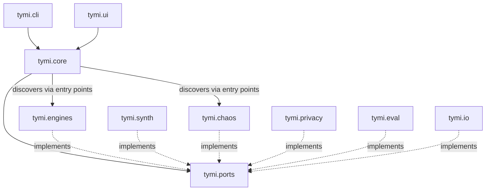
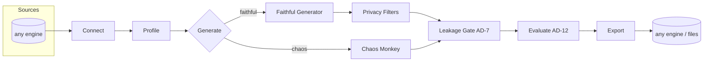

# Architecture Spine — TYMI

## Design Paradigm

**Hexagonal (Ports & Adapters)** wrapping a **pipes-and-filters pipeline**. A pure domain core defines abstract Ports; all I/O lives in swappable Adapters; dependencies point inward. The core runs one linear pipeline over immutable artifacts.

| Layer | Namespace | Role |
| --- | --- | --- |
| Domain core | `tymi.core` | Pipeline orchestrator + artifacts (Profile, Dataset, FidelityReport, FaultManifest) |
| Ports | `tymi.ports` | Interfaces: `EngineAdapter`, `Synthesizer`, `Mutator`, `PIIClassifier`, `PrivacyFilter`, `Evaluator`, `Exporter` |
| Driven adapters | `tymi.engines`, `tymi.synth`, `tymi.chaos`, `tymi.privacy`, `tymi.eval`, `tymi.io` | Concrete implementations of Ports |
| Driving adapters | `tymi.cli`, `tymi.ui` | Build a `Config` and invoke the core orchestrator |

## Invariants & Rules

### AD-1 — Hexagonal core [ADOPTED]

- **Binds:** all
- **Prevents:** domain logic coupling to a DB engine, CLI, or UI; integration points diverging
- **Rule:** `tymi.core` imports only `tymi.ports` (abstractions). Every DB/file/CLI/UI touch lives in an adapter. Dependencies point inward only (adapters → core, never the reverse).

### AD-2 — Bidirectional EngineAdapter

- **Binds:** FR-1, FR-2, FR-3, FR-17; NFR (interchangeable source↔destination)
- **Prevents:** separate source-vs-sink class hierarchies that break "any engine → any engine"
- **Rule:** each engine implements ONE `EngineAdapter` exposing both read (`introspect`, `sample`) and write (`load`). "Source" and "destination" are runtime roles of the same interface, chosen independently per run. Each adapter advertises capability flags (`supports_introspect`, `supports_sample`, `supports_write`) and its write semantics (transactional vs bulk); the orchestrator validates a chosen source/destination against these before running (e.g. StarRocks bulk-load vs MySQL transactional, though both use PyMySQL).

### AD-3 — Extensibility via entry points

- **Binds:** NFR-5; all `Mutator` and `EngineAdapter` types
- **Prevents:** editing the core to add a new engine or fault type
- **Rule:** `EngineAdapter`s and `Mutator`s are discovered via `importlib.metadata` entry points (groups `tymi.engines`, `tymi.mutators`). The core never imports a concrete adapter/mutator by name.

### AD-4 — Single explicit RNG

- **Binds:** NFR-4; every stochastic component
- **Prevents:** nondeterminism from global/hidden random state
- **Rule:** one `numpy.random.Generator` is created from `config.seed` at pipeline entry and passed explicitly to every stochastic component. No module uses global `random`/`np.random.*` or time-based seeds.

### AD-5 — Config is the single source of truth

- **Binds:** FR-18, FR-19, FR-20, FR-22; CLI↔UI parity
- **Prevents:** CLI and UI drifting; unversioned/unvalidated config
- **Rule:** every run is fully described by one Pydantic-v2 `Config` loaded from YAML. CLI and UI both construct the same `Config` and call the same orchestrator. `Config` carries a semver `schema_version`; the loader rejects an unknown major version. Each plugin (Mutator / EngineAdapter) declares its own Pydantic param schema; the loader validates that plugin's Config param block against it at load time — a valid Config major does not imply a valid plugin param block.

### AD-6 — Profile holds no re-identifiable raw values

- **Binds:** NFR-1; FR-4, FR-6
- **Prevents:** leakage through the Profile artifact
- **Rule:** the Profile persists only aggregates (histograms, quantiles, category frequencies, correlation matrices, inferred patterns) + schema metadata + PII tags. Never raw row values; free-text columns keep only pattern/length statistics.

### AD-7 — Zero leakage by exact membership check

- **Binds:** NFR-1, SM-2; FR-9, FR-23; both Generate branches
- **Prevents:** real sensitive values slipping into output (including via a chaos Mutator); the "proven by sampling" fallacy
- **Rule:** the exact-membership **leakage gate** is a CORE pre-export stage that runs on the final Dataset for BOTH branches (faithful and chaos): every value in a Sensitive Column is checked against a hashed set of the source's real values — a collision is regenerated (faithful) or rejected (chaos). No branch reaches Export ungated. This is distinct from the FR-24 similarity/outlier **Privacy Filters**, which are faithful-only quality filters.

### AD-8 — One pipeline, orchestrated in core

- **Binds:** all features
- **Prevents:** CLI and UI each re-implementing orchestration or stage ordering
- **Rule:** `Connect → Profile → Generate(Faithful→PrivacyFilters | Chaos) → LeakageGate → Evaluate → Export` is a single core orchestrator over immutable artifacts. The LeakageGate (AD-7) and Evaluate run on both branches. Driving adapters only build `Config` and invoke it; each stage consumes/produces a defined artifact.

### AD-9 — Permissive-license-only dependencies [ADOPTED]

- **Binds:** all dependencies
- **Prevents:** shipping a tool encumbered by production-restricted or strong-copyleft terms
- **Rule:** only OSI-permissive licenses (MIT / Apache-2.0 / BSD / LGPL-as-dynamic-dependency). **SDV (BUSL-1.1) is excluded.** Every new dependency's license is verified before adoption.

### AD-10 — Canonical Dataset Schema

- **Binds:** FR-7..FR-17; all pipeline stages
- **Prevents:** producer/consumer dtype disagreement (e.g. pandas `category`/`Decimal` a downstream stage or Exporter can't consume)
- **Rule:** a Dataset is a `pandas.DataFrame` **plus** a canonical `Schema` (per-column logical type + engine-agnostic dtype) derived from the Profile. Every stage preserves the Schema; Exporters and `EngineAdapter.load` map from the canonical Schema, never from raw pandas dtypes.

### AD-11 — Explicit RNG in Port signatures

- **Binds:** NFR-4; AD-3, AD-4; every stochastic Port method
- **Prevents:** entry-point plugins threading their own RNG or accepting `rng` inconsistently, silently breaking determinism
- **Rule:** every stochastic Port method takes the Generator as a required keyword-only parameter `rng: numpy.random.Generator`. Plugins draw all randomness from it; sampling/synthesis/mutation never create their own RNG or use global state.

### AD-12 — Evaluate branch contract

- **Binds:** FR-16, FR-18, FR-25; `eval/`
- **Prevents:** Evaluate receiving two incompatible input shapes with no discriminator
- **Rule:** Evaluate consumes `(Dataset, run_mode)`. `run_mode` discriminates: **faithful** → produces the FidelityReport + Quality/Privacy metrics (requires the source Profile); **chaos** → validates/emits the FaultManifest (no SDMetrics fidelity). The orchestrator sets `run_mode`; Evaluate never infers it.

### Dependency direction



## Consistency Conventions

| Concern | Convention |
| --- | --- |
| Naming | `snake_case` modules/functions, `PascalCase` classes; Port interfaces are nouns (`EngineAdapter`, `Exporter`); domain artifacts match Glossary terms exactly (`Profile`, `Dataset`, `ChaosPolicy`, `FaultManifest`, `FidelityReport`). |
| Data & formats | in-memory dataset = `pandas.DataFrame`; dates ISO-8601; `seed` is an `int`; Profile & Config serialize to YAML/JSON with a `schema_version`; errors are typed `TymiError` subclasses (never bare strings). |
| State & cross-cutting | artifacts are immutable and passed forward (no in-place mutation across stages); the RNG is threaded, never global; structured logging (`structlog`-style key/values); config via Pydantic only; no auth in MVP (local use). |
| Testing | `pytest`; unit tests pure-core; integration tests use `testcontainers`; statistical-validation tests assert fidelity via SDMetrics thresholds in CI. |

## Stack

| Name | Version |
| --- | --- |
| Python | 3.11+ (CI 3.11–3.13) |
| uv (packaging/deps) | current |
| pandas · numpy · scipy | current |
| Faker (formatted values, MIT) | 40.x |
| ~~SDMetrics (quality + privacy metrics, MIT)~~ — **excluded (Story 2.7)**: the package is MIT but transitively depends on `copulas` (BUSL-1.1), which AD-9 forbids. Its metric *definitions* (KSComplement / TVComplement / CorrelationSimilarity) are reproduced in-house on scipy+numpy, as with the in-house Gaussian copula. | — |
| ~~Presidio Analyzer (PII, MIT)~~ — **deferred (Story 4.1)**: Presidio is MIT (AD-9-fine) but pulls spaCy + a large downloaded language model that a reproducible CI/devcontainer build should not require. MVP PII classification is **rules-based** (regex value validators + column-name hints); Presidio/spaCy NER (free-text person/location detection) is a documented follow-up. This is a **scope decision for weight/reproducibility, not an AD-9 license exclusion** (contrast the SDMetrics→copulas BUSL removal above). | — |
| SQLAlchemy (core) | 2.0.x |
| pyodbc (MSSQL) | 5.3.x |
| PyMySQL (MySQL + StarRocks) | 1.2.x |
| psycopg (PostgreSQL, v3; LGPL as dynamic dep — see AD-9; pg8000/BSD alt) | 3.3.x |
| Pydantic | 2.13.x |
| PyYAML | current |
| Typer (CLI) | 0.24.x |
| Streamlit (web UI, Apache-2.0) | 1.x |
| pytest · testcontainers | current · 4.14.x |

## Structural Seed

```text
tymi/
  pyproject.toml            # uv-managed; entry points declare engines + mutators
  src/tymi/
    core/                   # pipeline orchestrator; artifacts: Profile, Dataset, FidelityReport, FaultManifest
    ports/                  # EngineAdapter, Synthesizer, Mutator, PIIClassifier, PrivacyFilter, Evaluator, Exporter
    engines/                # mssql, mysql, starrocks, postgres  (entry point: tymi.engines)
    profiling/              # per-column profilers + correlation detection
    synth/                  # faithful generator (in-house Gaussian copula on numpy/scipy + faker) + conditional/seeded generation
    chaos/                  # mutator engine + built-in mutators  (entry point: tymi.mutators)
    privacy/                # rules-based PII classifier (NER deferred) + privacy filters (similarity/outlier)
    eval/                   # SDMetrics quality & privacy report; fidelity report
    io/                     # exporters (csv/parquet/json/sql) + loaders
    config/                 # Pydantic config models + YAML loader (schema_version)
    cli/                    # Typer app  (driving adapter)
    ui/                     # Streamlit app  (driving adapter)
  tests/
    unit/  integration/  statistical/
```



## Capability → Architecture Map

| Capability / Area | Lives in | Governed by |
| --- | --- | --- |
| 4.1 Connectivity & introspection (FR-1..3, FR-17) | `engines/`, `ports.EngineAdapter` | AD-1, AD-2, AD-3 |
| 4.2 Statistical profiling (FR-4..6) | `profiling/`, `core` (Profile) | AD-6 |
| 4.3 Faithful generation + conditional (FR-7..10) | `synth/` | AD-4, AD-7, AD-8, AD-10, AD-11 |
| 4.4 Data Chaos Monkey (FR-11..16) | `chaos/` | AD-3, AD-4, AD-7, AD-8, AD-11, AD-12 |
| 4.5 Output/reporting/interfaces (FR-17..22) | `io/`, `cli/`, `ui/`, `core` | AD-5, AD-8, AD-10 |
| 4.6 Privacy & evaluation (FR-23..25) | `privacy/`, `eval/` | AD-6, AD-7, AD-9, AD-12 |

## Resolved Technical Defaults

*From the PRD's open questions — adopted with best-practice defaults, all configurable. `[ASSUMPTION]` = confirm/adjust.*

- **Similarity test / Tolerance** `[ASSUMPTION]`: per-column via the `KSComplement` (numeric, two-sample vs a Profile-reconstructed reference) and `TVComplement` (categorical) metric definitions — computed **in-house** (scipy+numpy), not the SDMetrics package (excluded by AD-9, see Stack); a column passes at score ≥ **0.9** (default Tolerance), configurable (Story 2.7).
- **Correlation level (MVP)** `[ASSUMPTION]`: pairwise, via an **in-house Gaussian copula** on numpy/scipy (empirical marginal CDF → normal scores → correlation matrix → multivariate-normal sampling → inverse transform). Not the `Copulas` library (BUSL-1.1, excluded by AD-9). Higher-order/vine copulas → Deferred.
- **Date seasonality (MVP)** `[ASSUMPTION]`: observed range + day-of-week/month frequency only. Full seasonality → Deferred.
- **Chaos acceptance margin** `[ASSUMPTION]`: default **±2 percentage points** on configured corruption rate, configurable per fault.
- **Config versioning**: semver `schema_version` field; loader accepts same major, rejects unknown major.

## Deferred

- **REST API / FastAPI** — no non-UI consumer in MVP; the Python library + CLI are the programmatic surface. Add when an external service needs HTTP.
- **Higher-order correlations / vine copulas** — MVP passes on pairwise Gaussian copula (PRD v2).
- **Cross-table statistical correlation** (beyond referential integrity) — PRD v2.
- **Pluggable ML/DL synthesizer backend** (GAN/LLM) — the `Synthesizer` Port allows it later; not built for MVP (PRD v2+).
- **Formal differential privacy** — PRD v2+.
- **Distributed / cluster-scale generation** — PRD v2.
- **Auth / RBAC in the UI** — v1 is local, no auth (PRD confirmed).
- **polars data backend** — pandas for MVP; revisit for >10M-row performance.
