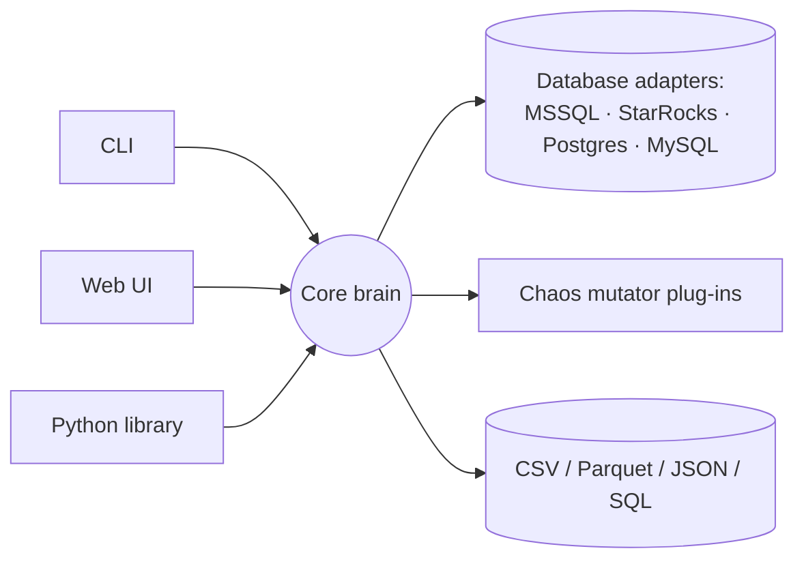
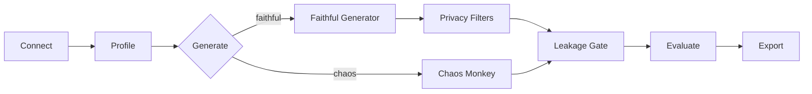

# TYMI — Solution Design (plain-language companion)

*Reader-friendly walkthrough of the architecture. The binding contract is `ARCHITECTURE-SPINE.md`; this document explains it. Created 2026-07-01.*

## 1. What we're building, in one paragraph

TYMI is a Python tool that does two things over your database tables:

1. **Faithful Generator** — looks at a real table, learns its *statistical shape* (how values are distributed, how columns relate), and produces **fake rows that look statistically identical but contain no real data**. Safe to use in dev, test, demos, and CI.
2. **Data Chaos Monkey** — deliberately produces **broken data** (weird outliers, wrong types, malformed formats, schema/constraint violations) in a *controlled, repeatable* way, so you can test whether your pipelines and validations catch bad data before production does.

You drive it from a **command line (CLI)**, a **Python library**, or a **web UI** — all three do exactly the same thing because they read the same config file.

## 2. The one big idea: one brain, many plugs

The whole design rests on a well-known pattern called **Hexagonal architecture (Ports & Adapters)**. The plain-language version:

- There is **one "brain" (the core)** that knows the logic: how to profile, generate, inject chaos, check privacy, evaluate, export.
- The brain never talks to a database, a file, or a screen directly. Instead it defines **"plugs" (Ports)** — abstract shapes like "something that can read/write a database" or "something that mutates data."
- The real-world pieces are **"adapters"** that fit those plugs: a MSSQL adapter, a MySQL adapter, a CSV exporter, a chaos mutator, and so on.

Why this matters for you:

- **Any database → any database.** Because every engine is the same kind of plug, you can profile from MSSQL and load into PostgreSQL — any source, any destination. (AD-2)
- **Add new things without touching the brain.** A new database engine or a new type of data-fault is just a new plug-in, discovered automatically. (AD-3, via Python "entry points")
- **The CLI, library, and UI are all just plugs on the same brain** — so they can never drift apart. (AD-5, AD-8)



## 3. How a run flows (the pipeline)

Every run is the same assembly line, run by the core:



- **Connect** to a source, **Profile** it (learn the shape), then **Generate** either faithful or chaotic data.
- The **Leakage Gate** runs on *both* paths — it guarantees no real sensitive value ever reaches the output, even through a chaos plug-in. (This was a hole the review caught; now closed by AD-7.)
- **Evaluate** produces the quality/privacy report (faithful) or validates the fault manifest (chaos), then **Export** writes it out.

## 4. Two guarantees we designed in

- **Same seed → same result, every time.** One random-number generator is created from your `seed` and passed by hand to every step (AD-4, AD-11). No hidden randomness. This is what makes CI runs reproducible.
- **Zero leakage, *proven* not *estimated*.** For sensitive columns we check every generated value against the real ones with an exact lookup and regenerate on any collision (AD-6, AD-7). We don't "spot-check by sampling" — sampling can't prove something is absent.

## 5. The technology choices (and one important license story)

Everything is **Python, CPU-only** (no GPU needed), and — critically — **every dependency is permissively licensed** so TYMI can be freely distributed and used in production (AD-9).

| Job | We use | Note |
| --- | --- | --- |
| Data handling & math | pandas, numpy, scipy | standard |
| Correlation-preserving synthesis | **in-house Gaussian copula** on numpy/scipy | see license story below |
| Realistic fake values | Faker (MIT) | emails, names, etc. |
| Quality & privacy metrics | SDMetrics (MIT) | quality score + membership/attribute inference |
| PII detection | Presidio (MIT, Microsoft) | finds sensitive columns |
| Database access | SQLAlchemy + pyodbc / PyMySQL / psycopg | StarRocks connects via the MySQL protocol |
| Config | Pydantic v2 + YAML | one validated config file |
| CLI | Typer (MIT) | |
| Web UI | Streamlit (Apache-2.0) | pure Python — no separate JavaScript app |
| Testing | pytest + testcontainers | real DBs in throwaway containers |

**The license story (why it matters):** The obvious tools for this job — **SDV** and its **Copulas** library — are both under **BUSL-1.1**, a "source-available" license that **restricts production use**. Using them would legally cripple TYMI as a distributable tool. So we **excluded both** and instead:

- write the **Gaussian copula ourselves** on numpy/scipy (about 100 lines — fit each column's distribution, correlate them through a normal distribution, sample back), and
- keep **SDMetrics** (which *is* MIT, even though its sibling SDV isn't) for the quality/privacy scoring.

This is more code but keeps TYMI fully free and gives us complete control over reproducibility.

> One notable divergence from the PRD: the PRD assumed a *FastAPI + React* web app. For a single-language, beginner-friendly stack we chose **Streamlit** (the UI calls the core directly, in-process) and **deferred FastAPI** until some non-UI service actually needs an HTTP API. Fewer moving parts, one language. *This should be reflected back into the PRD.*

## 6. Where things live (folder map)

```text
src/tymi/
  core/        the brain: pipeline + artifacts (Profile, Dataset, reports, manifest)
  ports/       the "plugs": abstract interfaces
  engines/     database adapters (mssql, mysql, starrocks, postgres)
  profiling/   learns the statistical shape
  synth/       faithful generator (our Gaussian copula + Faker)
  chaos/       the Chaos Monkey + fault mutators
  privacy/     PII detection + privacy filters
  eval/        quality & privacy reports
  io/          exporters and loaders
  config/      the YAML config models
  cli/         Typer command line
  ui/          Streamlit web app
```

## 7. The 12 architecture decisions in plain words

| # | Decision | Why it exists |
| --- | --- | --- |
| AD-1 | One pure core; all I/O in adapters | keeps the brain independent of DBs/UI |
| AD-2 | Each DB is one bidirectional adapter with capability flags | enables any-source → any-destination safely |
| AD-3 | New engines/faults are auto-discovered plug-ins | extend without touching the core |
| AD-4 | One seeded random generator, passed explicitly | reproducibility |
| AD-5 | One validated, versioned config is the source of truth | CLI/UI can't drift; plug-in params validated too |
| AD-6 | The Profile stores only aggregates, never raw values | privacy at rest |
| AD-7 | Leakage gate on **both** paths (exact check) | no real sensitive value ever leaks |
| AD-8 | One pipeline, orchestrated in the core | CLI/UI don't re-implement flow |
| AD-9 | Only permissive licenses (SDV & Copulas excluded) | TYMI stays freely distributable |
| AD-10 | A Dataset carries a canonical schema every stage keeps | producers/consumers agree on data shape |
| AD-11 | Plug-in methods must accept the shared `rng` | third-party plug-ins can't break determinism |
| AD-12 | Evaluate has a defined contract per run mode | faithful vs chaos reports don't get confused |

## 8. What we deferred (and what to confirm)

**Deferred to later / v2:** REST API (FastAPI), higher-order correlations, cross-table correlation, ML/deep-learning synthesis backend, differential privacy, cluster-scale generation, UI auth, polars performance backend.

**Best-practice defaults we picked — please sanity-check (all configurable):**

- Similarity scoring via SDMetrics `KSComplement`/`TVComplement`, a column "passes" at ≥ **0.9**.
- Correlations modeled **pairwise** (Gaussian copula); higher-order later.
- Dates: range + day-of-week/month frequency only for now.
- Chaos rate tolerance: **±2 percentage points** by default.
