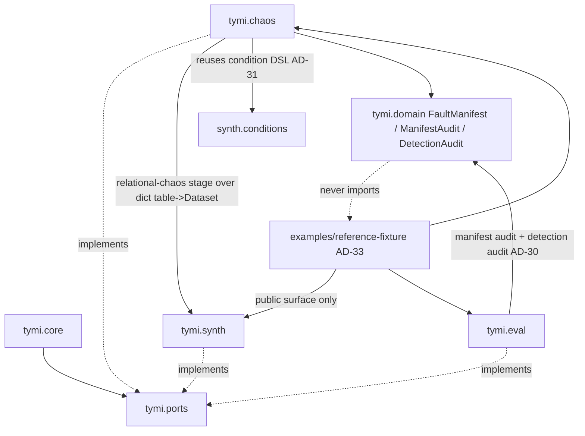
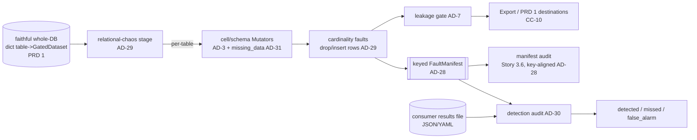

# Architecture Spine — TYMI Content Chaos (PRD 2)

## Design Paradigm

Inherited verbatim from the TYMI initiative spine (`architecture-tymi-2026-07-01`):
**Hexagonal (Ports & Adapters) over a pipes-and-filters pipeline**. A pure `tymi.core`
depends only on `tymi.ports`; every DB/file/CLI/UI touch lives in an adapter;
dependencies point inward. PRD 2 adds **no new paradigm and no new layer** — it extends
the `chaos/` and `eval/` adapters and the `FaultManifest`/`ManifestAudit` domain
artifacts, and adds one self-contained example package outside the hexagon.

The single genuinely-new structural move: the **Fault Manifest stops being
positional-per-row and becomes keyed-per-row**, which is what lets a deletion/insertion
be represented and audited at all.

## Inherited Invariants

All read-only; never renumbered, never re-derived. A local decision that weakens one is a
conflict to surface, not an override.

| Inherited | From parent | Binds here |
| --- | --- | --- |
| AD-1 hexagonal core; AD-3 Mutator/Engine via `tymi.mutators`/`tymi.engines` entry points | MVP spine `…-2026-07-01` | new fault families register as entry points; core never imports a concrete mutator |
| AD-4 / AD-11 one injected `numpy.random.Generator`, keyword-only in every stochastic Port method | MVP spine | every new mutator/stage draws all randomness from the threaded `rng`; determinism (G3) |
| AD-6 / AD-7 leakage gate + zero real values; chaos output is re-gated pre-export | MVP spine | chaotic whole-DB output passes the leakage gate before Export; a fault may not become a leak |
| AD-9 permissive-only deps (numpy/pandas/PyYAML already in stack) | MVP spine | **no new runtime dependency** in PRD 2 |
| AD-10 canonical `Schema` per Dataset | MVP spine | schema-drift faults (CC-5/CC-7) express change as a delta off the canonical Schema |
| AD-12 Evaluate `chaos` run_mode emits/validates the `FaultManifest` | MVP spine | both the manifest audit (Story 3.6) and the new detection audit (CC-11) live in `eval/` under chaos run_mode |
| AD-13 / AD-16 / AD-21 whole-DB `Spec` → `generate_from_spec` → `dict[table → GatedDataset]`; position-derived PKs; GatedDataset load boundary | PRD 1 spines | content chaos **consumes** the faithful whole-DB output; every whole-DB table has a deterministic PK usable as the manifest row key |
| import-linter contracts: only `core`/`ports`/`domain` are forbidden from importing adapters | codebase | **adapter→adapter is allowed** (precedent: `synth.whole_db` imports `tymi.privacy.classifier`), so `chaos` may import `synth.conditions` without a new contract |

## Invariants & Rules

### AD-28 — Row identity is a frozen baseline label, never re-derived from the mutated frame

- **Binds:** CC-1, CC-3, CC-8, CC-11; G3
- **Prevents:** a positional Fault Manifest that can neither represent a deletion/insertion
  nor survive one (deleting a row shifts every lower frame index; today
  `chaos_audit._audit_cells` marks any row-count change `(unauditable)`) — **and** two
  conformant builders diverging on how the key is bound after a PK-mutating fault
  (`duplicate_keys` copying a PK, MNAR nulling a PK, a dropped/renamed PK column).
- **Rule:** at the **start** of the relational-chaos stage, before **any** fault of any
  stage, each table's rows are stamped with a stable **`row_key`** carried as the frame's
  **index** (so per-table `Mutator`s preserve it with no port change — cell/schema faults
  keep row order and count). The `row_key` source, in order: the table's declared
  **primary-key value** if present and unique; else the **position-derived surrogate key**
  the whole-DB generator assigns (AD-16). A table with **neither a unique PK nor a
  surrogate key fails closed** — cardinality faults are not applied to an unkeyable table.
  The label is a **frozen snapshot**: a fault that mutates a PK column records its effect
  but **never changes a row's identity**. Composite/typed PK values encode canonically
  (see Conventions) so producer, audit, and results file agree byte-for-byte. Every
  manifest entry carries **`(table, row_key)`**; frame position (`row`) is retired from the
  contract. The audit aligns baseline↔chaotic **by label**:
  `deletions = baseline_labels − surviving_labels`,
  `insertions = new_labels` (minted per AD-29). Key-alignment **requires labels unique
  within each table**; when `duplicate_keys` is composed the duplicated rows form an
  **audit-excuse region** (like the existing row-count guard) rather than silently
  collapsing — because identity is the frozen baseline label, not the duplicated live PK,
  the duplication is recorded without losing any row's identity.

### AD-29 — Cardinality faults run on a relational (whole-DB) chaos surface

- **Binds:** CC-1
- **Prevents:** a single-table `Mutator` silently orphaning children across a join with no
  way to record or propagate the cross-table effect; unauditable RI corruption.
- **Rule:** row deletion/insertion is applied by a **relational-chaos stage** over the
  whole-DB `dict[table → Dataset]` and the FK graph (`Schema.foreign_keys`, PRD 1 whole-DB
  model) — **not** by a per-table `Mutator`. Dropping a parent row records a
  `dropped_record` on the parent; the children that referenced it are **left dangling**
  (not cascade-deleted — cascading would double-count deletions and hide the orphan) and
  each is recorded as an **`orphaned_child`** fault keyed by `(table, row_key)` (AD-28).
  Inserted rows get **freshly-minted `row_key`s drawn from a reserved, baseline-disjoint
  keyspace** (mirroring AD-16/AD-17 reserved blocks) — never a reused deleted key, never a
  key already in `baseline_labels`. Per-table cell/schema `Mutator`s (AD-3 engine) are
  unchanged and run *within* this surface. **Deterministic compose order:** cell/schema
  faults first, cardinality (row delete/insert) **last**; tables are visited in
  **FK-topological order** (parents before children) and the injected `rng` (AD-4/AD-11)
  chooses which rows are dropped/inserted, so the same seed+config yields the same rows and
  the same manifest bytes (G3).

### AD-30 — Detection audit is a diff over a declared consumer results file

- **Binds:** CC-11; G1
- **Prevents:** coupling the audit to any specific data-QA tool; an audit that can only
  check manifest-vs-output (Story 3.6) and cannot answer "did the consumer catch it?".
- **Rule:** the detection audit lives in `eval/` (chaos run_mode, AD-12) and consumes
  `(FaultManifest, results_file)` where the **results file** (JSON or YAML) lists what the
  consumer flagged, each entry keyed to the manifest fault vocabulary
  (`fault_type` / `table` / `row_key` / `column`). It emits three sets: **detected**
  (∩), **missed** (`manifest − results`), **false_alarm** (`results − manifest`). It ships
  the schema + a mapping helper only and imports no GE/dbt/tool. Distinct from the
  Story-3.6 manifest audit (which checks the manifest's faithfulness to the output); the
  detection audit checks a **third party's** detection against the manifest.

### AD-31 — Conditioned nullification (MAR/MNAR) reuses the shipped condition DSL

- **Binds:** CC-2, CC-4
- **Prevents:** a second, divergent condition parser inside `chaos`; a bespoke missingness
  grammar diverging from the generation-side one.
- **Rule:** a conditioned-nullification `Mutator` reuses `synth/conditions.py`
  (`Equals` / `Between` / `Members` — a pure, I/O-free parse/model/eval) by importing it
  directly (adapter→adapter, allowed). A rule pairs a parsed `Condition` with a per-stratum
  `null_rate`: **MAR** conditions on **another** column, **MNAR** on the affected column's
  **own** value; cells outside the condition keep the run base rate. Nullification records
  per-cell null faults by `(table, row_key, column)` under AD-28. (CC-4 partial-records =
  the same mechanism nulling a declared column subset per affected row.) To give **G2** an
  architectural home (MAR/MNAR ≠ MCAR is falsifiable, not vocabulary), the mutator records
  the **realized per-stratum null-rate** in the manifest, so the stratum-difference check
  is computable from the manifest alone without re-deriving the strata.

### AD-32 — Schema drift is a recorded delta off the canonical Schema

- **Binds:** CC-5, CC-7
- **Prevents:** type / nullability / column-order drift that a contract test cannot diff or
  version.
- **Rule:** schema-drift faults emit an explicit **`SchemaDelta`** (ops: add / drop /
  rename / retype / nullability-change / **reorder** columns) keyed off the AD-10 `Schema`
  and recorded in the manifest's structural channel, so `old → new` is diffable
  declaratively. **Column reorder (CC-5)** is a delta op that permutes column order without
  changing the column set — the one column-level drift the MVP lacks; `_audit_structural`
  is extended to recognize it and emit the delta rather than reading it as drop+add. A
  `SchemaDelta` with multiple ops applies them in a **fixed intra-delta order — rename →
  retype → nullability → reorder (last)** — and a reorder is a **permutation over the
  current (post-rename) column names**, so two builders can't produce a different final
  column order or a `KeyError` from name ambiguity.

### AD-33 — The reference fixture is a self-contained example package outside the hexagon

- **Binds:** CC-9; G1
- **Prevents:** the toy pipeline / alert suite leaking into `tymi.*` and becoming importable
  by core; a demo that depends on a real team.
- **Rule:** the synthetic reference fixture (a multi-table `customers`/`orders` Spec + a toy
  pipeline of deterministic transforms/joins + a data-QA alert suite + a declared results
  file) lives as a **self-contained package under `examples/`** (packaged into
  `tests/fixtures/reference/` for CI). It consumes **only** the public library surface
  (`Spec` / provision / chaos / eval), is exercised in CI to demonstrate **G1** (≥ 1
  injected fault the pipeline/alerts miss), and is imported by **no** `tymi.*` module.

### AD-34 — Cardinality faults are Chaos-Policy-governed; the faithful remainder stays faithful

- **Binds:** CC-8 (policy half); CM2
- **Prevents:** cardinality faults that ignore the mixed-mode `rate` contract (AD-12 /
  Story 3.5), or that corrupt rows the policy meant to leave faithful — CM2 requires the
  faithful baseline to stay faithful in mixed mode.
- **Rule:** the relational-chaos stage is driven by the **Chaos Policy** (`chaos/policy.py`,
  extended): in **mixed** mode a `rate` fraction of rows is eligible for deletion/partial
  faults and the rest are emitted byte-identical to the faithful baseline (CM2); in
  **fully_chaotic** mode over an FK graph the RI break is by design and requires explicit
  confirmation (inherited guard). A structural cardinality change (dropping rows) is
  policy-gated the same way a per-row schema change is — the policy decides scope, the stage
  records every dropped/orphaned row in the manifest (AD-28) so the realized fraction is
  auditable against `rate`.

### Dependency direction (PRD 2 additions over the inherited graph)



## Consistency Conventions

| Concern | Convention |
| --- | --- |
| Fault vocabulary | one shared vocabulary across manifest, audit, and results file: `fault_type` ∈ {existing cell/structural faults, `dropped_record`, `inserted_record`, `orphaned_child`, `sequence_gap`, `conditioned_null`, `schema_reorder`, …}, plus `table`, `row_key`, `column`. |
| Row key encoding | canonical: a **JSON array of the PK values in schema-declared column order**, with ints/floats normalized (`1.0`→`1`) — one encoding shared by manifest, audit, and the results-file mapping helper, so `detected = ∩` never mis-classifies a real detection through a formatting mismatch. Source per AD-28 (declared PK, else AD-16 surrogate); never a live frame index. |
| Results file | JSON **or** YAML (PyYAML, in stack); one declared schema; entries keyed to the fault vocabulary above. Same seed + config → byte-identical manifest **and** stable audit sets (G3). |
| Determinism (G3) | cell/schema faults compose **before** cardinality faults; tables visited in **FK-topological order**; the injected `rng` (AD-4/AD-11) drives which rows drop/insert; deletions recorded before the frame shrinks; before serialization the manifest is sorted by **(table, row_key, fault_type)** so the bytes are stable regardless of emission order. |
| Manifest versioning | the extended manifest shape bumps a `manifest_version` (adds `table`/`row_key`/cardinality fault types) so a results file and audit can assert the contract they target. |
| Naming | `SchemaDelta`, `DetectionAudit`, `dropped_record`/`inserted_record` follow existing `PascalCase` artifact / `snake_case` fault-type conventions. |

## Stack

No new dependencies (AD-9). Everything PRD 2 needs is already pinned by the MVP spine:

| Name | Version | Used for |
| --- | --- | --- |
| pandas · numpy | current | row delete/insert, keyed cell diff, conditioned nullification |
| PyYAML | current | the JSON/YAML results file (CC-11) |
| pytest | current | the reference-fixture CI harness (CC-9) |

## Structural Seed

Modules PRD 2 adds or extends (everything else inherited, unchanged):

```text
src/tymi/
  domain/artifacts.py     # EXTEND: FaultManifest entry convention (table, row_key,
                          #   cardinality fault_types, manifest_version); + SchemaDelta,
                          #   DetectionAudit  (entries stay a list[dict]; the *convention*
                          #   and helpers gain the keyed shape — not an enforced schema)
  chaos/
    relational.py         # NEW: relational-chaos stage over dict[table->Dataset] + FK graph;
                          #   stamps row_key index; cardinality faults CC-1; seq gaps CC-3 [AD-28/29]
    policy.py             # EXTEND: mixed-mode Chaos Policy governs cardinality faults [AD-34]
    mutators/
      missing_data.py     # NEW: conditioned nullification MAR/MNAR + partial records
                          #   (CC-2/CC-4), reusing synth.conditions            [AD-31]
      schema_break.py     # EXTEND: column reorder + SchemaDelta emission (CC-5/CC-7) [AD-32]
  eval/
    chaos_audit.py        # EXTEND: key-aligned diff; cardinality auditable      [AD-28]
    detection_audit.py    # NEW: results-file diff -> detected/missed/false_alarm [AD-30]
examples/
  reference_fixture/      # NEW: customers/orders Spec + toy pipeline + alert suite
                          #   + declared results file; CI-exercised, outside tymi.*  [AD-33]
tests/fixtures/reference/ # the fixture wired into CI (proves G1)
```



## Capability → Architecture Map

| Capability | Lives in | Governed by |
| --- | --- | --- |
| CC-1 dropped records (referential) | `chaos/relational.py` | AD-28, AD-29 |
| CC-3 sequence gaps | `chaos/relational.py` | AD-28, AD-29 |
| CC-8 cardinality-aware manifest + policy | `domain/artifacts.py`, `chaos/policy.py` | AD-28 (manifest), AD-34 (policy) |
| CC-9 reference fixture | `examples/reference_fixture/` | AD-33 |
| CC-10 batch/DB delivery | `io/` exporters + PRD 1 destinations | AD-10 (inherited) |
| CC-11 detection audit | `eval/detection_audit.py` | AD-30 |
| CC-2 conditioned nullification (MAR/MNAR) | `chaos/mutators/missing_data.py` | AD-31 |
| CC-4 partial records | `chaos/mutators/missing_data.py` | AD-31 |
| CC-5 column reorder | `chaos/mutators/schema_break.py` | AD-32 |
| CC-7 versioned drift delta | `domain/artifacts.py` (`SchemaDelta`) | AD-32 |

> **Source reconciliation (CC-1).** The PRD states CC-1 "reuses the shipped `OrphanFkMutator` /
> `_drop_from_schema`." Verified against source, **neither deletes rows**: `orphan_fk`
> overwrites an FK *cell* with a non-existent value (row count unchanged) and `_drop_from_schema`
> drops *columns*. CC-1 (whole-row deletion, a cardinality change) is therefore genuinely new
> and ships as the AD-29 relational stage, not a reuse of those mutators. The PRD line should be
> corrected to "reuses PRD 1's whole-DB FK model" (offer to update it).

## Deferred

- **Streams / queues + API/OpenAPI-contract chaos** — PRD 3; the detection audit's
  results-file contract is stream-agnostic, so it carries forward unchanged.
- **A `RelationalMutator` entry-point port** — AD-29 ships cardinality faults as a stage,
  not a discovered port. Promote to a port (symmetric with AD-3) only when a **second**
  relational fault family needs it; premature now.
- **Promoting the condition DSL to `tymi.domain`** — AD-31 reuses it in place
  (`synth.conditions`) per the accepted adapter→adapter precedent. Relocate only if a
  cleaner boundary is later wanted.
- **Cardinality faults over out-of-core streaming** — PRD 1 Phase 2 territory; PRD 2 is
  batch/DB (whole-DB in memory).
- **Learned / generative missingness models** — rule-based conditioning only (PRD 2 scope).
- **Live data-QA tool adapters (Great Expectations, dbt)** — the results-file contract is
  the integration seam; native adapters are follow-ons, not this spine.
