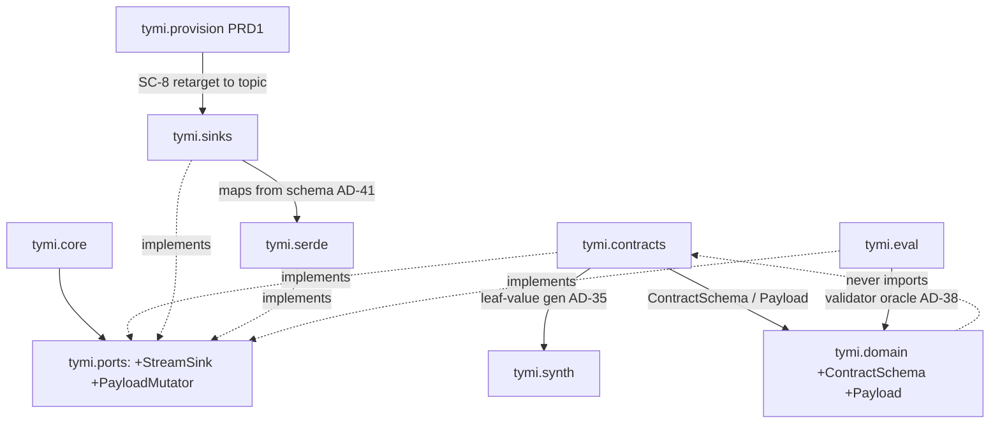
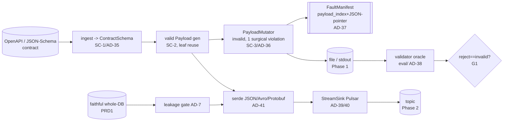

# Architecture Spine — TYMI Contracts & Streaming (PRD 3)

## Design Paradigm

Inherited verbatim from the TYMI initiative spine (`architecture-tymi-2026-07-01`):
**Hexagonal (Ports & Adapters) over a pipes-and-filters pipeline**. PRD 3 adds **two new
driven-adapter families** (`contracts/`, `sinks/`) and a serialization module (`serde/`) under
the existing core, plus **two new ports** (`StreamSink`, `PayloadMutator`) and **two new
artifacts** (`ContractSchema`, `Payload`).

The one genuinely-new structural move: contracts describe **nested** documents, so PRD 3 opens
a **nested sibling domain** next to TYMI's **tabular** one — it does *not* stretch the flat
canonical Schema (AD-10) to carry nesting. What is actually reused is the chaos engine's
**patterns** (entry-point discovery, rng, FaultManifest, determinism) and the Faker overlay
(`fake_values`); the tabular `Dataset`/`Mutator` types are **not** reused, and — since a
contract carries **no source Profile** — the Profile-driven marginal generators are **not**
reused for constraint-only leaves. **Constraint-only leaf generation is net-new** (AD-35).

## Inherited Invariants

All read-only; never renumbered, never re-derived. A local decision that weakens one is a
conflict to surface, not an override.

| Inherited | From parent | Binds here |
| --- | --- | --- |
| AD-1 hexagonal core; AD-3 extensibility via entry points | MVP spine | new sinks / payload-mutators register as entry points; core imports no concrete |
| AD-2 EngineAdapter is bidirectional + tabular | MVP spine | `StreamSink` is a **separate, write-only** port — a stream is not a bidirectional tabular source |
| AD-4 / AD-11 one injected `numpy.random.Generator`, keyword-only | MVP spine | payload generation + mutation draw all randomness from the threaded `rng` (G3) |
| AD-6 / AD-7 leakage gate + zero real values | MVP spine | the leakage gate still runs on **faithful** stream output before serialization (SC-8) |
| AD-9 permissive-only deps | MVP spine | PRD 3 adds deps, but every client is permissive; **AD-42 extends the rule to servers** |
| AD-10 canonical flat `Schema` per `Dataset` | MVP spine | stays the **tabular** representation; contracts get `ContractSchema`, not a stretched `Schema` |
| AD-12 Evaluate `chaos` run_mode + `FaultManifest` | MVP spine | the validator **oracle** and the payload FaultManifest live under chaos run_mode in `eval/` |
| AD-13 `provision` composition adapter (PRD 1) | PRD 1 spine | SC-8 faithful stream provisioning reuses `provision`, retargeted to a topic via a `StreamSink` |
| import-linter: only core/ports/domain forbidden from importing adapters | codebase | add `tymi.contracts`, `tymi.sinks`, `tymi.serde` to the forbidden-for-core set; adapter→adapter allowed |

## Invariants & Rules

### AD-35 — Contracts are a nested domain, sibling to the tabular one — don't stretch AD-10

- **Binds:** SC-1, SC-2
- **Prevents:** forcing a recursive OpenAPI/JSON-Schema contract into the flat column `Schema`
  — arrays, `oneOf`/`anyOf`, deep `required`, `$ref` have no flat representation, and flattening
  loses exactly the structure the invalid-payload wedge must violate.
- **Rule:** SC-1 compiles a contract to a new **`ContractSchema`** in a **canonical normal
  form**: `$ref` kept as **named nodes** (never inlined), a cyclic/recursive `$ref` handled by a
  **bounded unroll depth `N`**, and `oneOf`/`anyOf`/`allOf` combinators in a **canonical order** —
  so two ingesters produce the *same* tree (and therefore the same JSON-pointers, AD-37, and the
  same serialization, AD-41). A **`Payload`** artifact is one JSON document + its `ContractSchema`.
  Valid generation (SC-2) walks the tree; a **leaf scalar** is drawn by the Faker overlay
  (`fake_values`) where a format/name heuristic applies, **else by a net-new, deterministic
  constraint-derived draw** whose distribution is fixed by this spine (a defined
  constraint-satisfying value per type/format/range/enum — **not** a Profile marginal, since a
  contract has no Profile) so the emitted bytes are builder-independent (AD-40). The flat
  canonical `Schema` (AD-10) remains the tabular representation; `ContractSchema`/`Payload` are new
  artifacts under the same core. *(Chose the nested-artifact option over flatten-to-columns: the
  wedge needs the nesting.)*

### AD-36 — Contract-invalid chaos is a `PayloadMutator` family — reuse the engine patterns, not the tabular port

- **Binds:** SC-3
- **Prevents:** shoehorning nested-payload mutation into `Mutator.apply(Dataset)` (wrong
  artifact), or forking a second bespoke discovery/chain/rng mechanism.
- **Rule:** a new **`PayloadMutator`** port — `apply(payload, contract, *, rng) -> (Payload,
  FaultManifest)` — discovered via a new entry-point group **`tymi.payload_mutators`** (mirroring
  AD-3), `rng`-threaded (AD-4/AD-11), manifest-merged like the tabular engine. A "violation" is
  defined at the **document level**: the mutated payload must make the *whole document* fail
  validation (not merely change a constraint-local value). Each invalid payload carries **exactly
  one** such document-invalidating violation (type / range / enum / required / format / nesting) at
  a configured rate — **surgical**, so the oracle attributes each rejection to one fault. Because a
  local change under `oneOf`/`anyOf`/`if-then`/`allOf`-alternative may leave the document *valid*
  (it matches another branch), the mutator family **fails closed** on such targets unless the flip
  is provably document-invalidating. Per **CM1**, the invalid set must **span subtle / boundary
  near-misses** (e.g. off-by-one on `minimum`, a single extra enum char), not only gross
  malformations. It reuses the engine's *discovery + chain + manifest + determinism* patterns,
  never the `Dataset`-typed `Mutator` port.

### AD-37 — Payload fault identity = `(payload_index, JSON-pointer, constraint)`

- **Binds:** SC-3; G3
- **Prevents:** reusing the tabular `row` or PRD 2's `(table, row_key)` identity for a nested
  document, where the violated thing is a **path**, not a row.
- **Rule:** a payload fault in the `FaultManifest` is keyed by the payload's **ordinal** in the
  emitted sequence + an **RFC-6901 JSON-pointer** to the violated location + the **violated
  constraint** id. The oracle and audit align on this triple. It is the payload analog of PRD 2's
  `(table, row_key)` (AD-28).

### AD-38 — The validator is an independent pass/fail oracle in `eval/`, never in the generation path

- **Binds:** SC-3; G1
- **Prevents:** a generator/mutator calling `jsonschema` to "check its work" — that couples
  producer and judge and hides a mutator that fails to actually violate (or a valid payload that
  is accidentally invalid).
- **Rule:** `jsonschema` / `openapi-core` validate the emitted payloads as an **independent
  oracle** in `eval/` (chaos run_mode, AD-12); it must **reject exactly** the manifest's invalid
  set and **accept** the valid set (G1, within the inherited ±2 pp margin). The producer never
  imports the validator; the oracle never mutates. Separation of powers: produce vs judge.

### AD-39 — `StreamSink` is a write-only destination port, separate from `EngineAdapter`

- **Binds:** SC-4, SC-7
- **Prevents:** overloading the bidirectional, tabular, transactional `EngineAdapter` with stream
  semantics; making a stream a bidirectional *source* (OQ-4 resolved emit-only).
- **Rule:** a new **`StreamSink`** port emits an **ordered sequence of `(topic, partition, key,
  value_bytes)`** records; **write-only** (no `introspect`/`sample`); discovered via a new
  entry-point group **`tymi.sinks`** (AD-3 pattern). Pulsar first (SC-4), Kafka + RabbitMQ later
  (SC-7). A stream is never a profiling source — profiling stays batch (AD-2 unchanged for DBs).

### AD-40 — Determinism SLA is the emit boundary, not broker state

- **Binds:** NFR-C; G3
- **Prevents:** promising byte-identical topic state — broker CreateTime, offsets, compression
  framing, and retry reordering are outside TYMI's control, an unfalsifiable, unownable SLA.
- **Rule:** reproducibility = the deterministic **ordered `(partition, key, value_bytes)`
  sequence + `FaultManifest`** for a given seed+config. Requires: timestamps **derived from the
  seed** (not wall-clock); the **idempotent producer** enabled; partitions assigned by a **fixed
  function `partition = payload_index mod partition_count`** (never the broker's key-hash), so two
  builders emit the same sequence; canonical serialization (AD-41). A record's **key** is the
  payload's natural key when the contract/Schema declares one, **else a seed-derived deterministic
  key** (`key = f(seed, payload_index)`) — never null, never wall-clock. The sink is judged on what
  it **emits**, not what the broker **stores**.

### AD-41 — Serialization maps from the schema-of-record, canonicalized, zero field loss

- **Binds:** SC-5; CM2
- **Prevents:** serializing from raw pandas dtypes (an AD-10 violation) or a lossy mapping that
  silently drops a field.
- **Rule:** serialize to **JSON / Avro / Protobuf (all three)** from the **schema-of-record**
  (the flat `Schema` for tabular faithful streams; the `ContractSchema` for contract payloads),
  **canonicalized** (sorted JSON keys / Avro canonical form / deterministic Protobuf field order)
  so emit-boundary bytes are stable (AD-40). **CM2:** a declared field that would be dropped on
  round-trip **fails closed**. Two mapping rules resolve the nested↔closed-world tension:
  **(a) open content** — a contract with `additionalProperties: true` carries fields the closed
  Avro/Protobuf schemas can't declare, so such a payload serializes **JSON-only** (or, if a binary
  format is required, extras map to a declared `map<string, …>` catch-all); it never silently
  drops them. **(b) `oneOf` → Avro/Protobuf union** uses the **canonical branch order** fixed by
  the `ContractSchema` normal form (AD-35), so the union tag is deterministic. Lives in a new
  **`tymi.serde`** module; the sink calls `serde`, `serde` maps from the schema.

### AD-42 — Talk-to but don't-bundle a non-permissive server; the registry is a client the sink uses

- **Binds:** SC-6, SC-7; extends AD-9
- **Prevents:** TYMI shipping / redistributing / auto-provisioning a non-permissive **server**
  (Confluent Schema Registry server = Confluent Community License; RabbitMQ server = MPL-2.0).
- **Rule:** TYMI links only permissive **clients** and may **connect** to any user-supplied
  broker/registry, but never **bundles** a non-permissive server. The Phase-2 reference registry
  is **Pulsar's in-broker registry (Apache-2.0)** — so Phase 2 is fully AD-9-clean;
  Confluent/Apicurio registries are user-supplied endpoints reached via permissive clients
  (Phase 3, with the Kafka sink).

### AD-43 — G2 faithfulness is a round-trip check at the emit boundary, not a broker-state read

- **Binds:** SC-8, G2; CM2
- **Prevents:** a G2 "faithful delivery" acceptance that reads back **topic state** — which
  AD-40 rules unownable — leaving G2 with no testable home, in tension with AD-40.
- **Rule:** G2 is verified by **deserializing the emitted `value_bytes`** (the emit-boundary
  artifact) back through `serde` and comparing the reconstructed record to the source, field by
  field, against the schema-of-record — **zero field loss (CM2)**. This needs **no live broker**
  for the correctness claim (a reference-consumer read from a real topic is an *integration* test
  layered on top, not the acceptance oracle). Faithful stream output first passes the leakage gate
  (AD-6/AD-7) **before** `serde` (SC-8).

### Dependency direction (PRD 3 additions over the inherited graph)



## Consistency Conventions

| Concern | Convention |
| --- | --- |
| Two schema worlds | **tabular** = `Dataset` + flat `Schema` (AD-10, DBs). **nested** = `Payload` + `ContractSchema` (AD-35, contracts). A stage declares which it consumes; the two never silently interconvert. |
| Payload fault key | `(payload_index, RFC-6901 JSON-pointer, constraint_id)` (AD-37); one document-invalidating violation per invalid payload (AD-36). Pointer rules for non-value constraints: **`required`** → pointer to the **parent object**, the missing field named in `constraint_id`; **`minItems`/`maxItems`** → pointer to the **array**; a **per-item** violation → pointer to the **index**. |
| Emit-boundary determinism | seed-derived timestamps, idempotent producer, pinned partitions, canonical bytes; the reproducible unit is the ordered `(partition, key, value_bytes)` sequence + manifest (AD-40) — never topic state. |
| Serialization | JSON / Avro / Protobuf, canonicalized; maps from the schema-of-record, never raw dtypes; zero field loss fails closed (AD-41). |
| License rule | permissive **clients** only; a non-permissive **server** may be talked-to, never bundled (AD-42). Phase-2 registry = Pulsar in-broker (Apache-2.0). |
| Naming | `StreamSink`, `PayloadMutator`, `ContractSchema`, `Payload` follow the existing `PascalCase` port/artifact convention; entry-point groups `tymi.sinks`, `tymi.payload_mutators` mirror `tymi.engines`/`tymi.mutators`. |

## Stack

New dependencies (all AD-9-permissive; versions web-verified 2026-07-05 / licenses 2026-07-04):

| Name | Version | License | Used for |
| --- | --- | --- | --- |
| jsonschema | 4.x | MIT | JSON-Schema ingestion + the validator oracle (SC-1, SC-3) |
| openapi-core | 0.23.1 | BSD-3 | OpenAPI 3.0/3.1/3.2 ingestion + validation oracle (SC-1, SC-3) |
| pulsar-client | 3.12.0 | Apache-2.0 | the Phase-2 `StreamSink` + in-broker schema registry (SC-4, SC-6) |
| fastavro | 1.x | MIT | Avro serialization (SC-5) |
| protobuf | 5.x | BSD-3 | Protobuf serialization (SC-5) |
| confluent-kafka | 2.x | Apache-2.0 | the Phase-3 Kafka `StreamSink` (SC-7) |
| pika | 1.3.x | BSD-3 | the Phase-3 RabbitMQ `StreamSink` (SC-7) |

## Structural Seed

Modules PRD 3 adds (everything inherited stays unchanged):

```text
src/tymi/
  domain/artifacts.py     # EXTEND: ContractSchema, Payload; FaultManifest payload-fault
                          #   convention (payload_index, json_pointer, constraint)  [AD-35/37]
  ports/__init__.py       # EXTEND: StreamSink (write-only), PayloadMutator ports   [AD-36/39]
  contracts/              # NEW driven adapter:
    ingest.py             #   OpenAPI/JSON-Schema -> ContractSchema ($ref-resolved)  [SC-1, AD-35]
    generate.py           #   valid Payload gen; net-new constraint leaf draw + Faker overlay [SC-2, AD-35]
    payload_mutators/     #   contract-aware invalid-payload family (tymi.payload_mutators) [SC-3, AD-36]
  serde/                  # NEW: JSON/Avro/Protobuf serializers, canonical, schema-mapped [SC-5, AD-41]
  sinks/                  # NEW driven-adapter family (entry group tymi.sinks):
    pulsar.py             #   Pulsar StreamSink + in-broker registry     [SC-4, SC-6, AD-39/42]
    kafka.py rabbitmq.py  #   Phase 3                                     [SC-7]
  eval/
    contract_oracle.py    # NEW: jsonschema/openapi-core independent oracle [SC-3, AD-38]
  provision/pipeline.py   # EXTEND: faithful stream provisioning -> a topic via StreamSink [SC-8]
```



## Capability → Architecture Map

| Capability | Lives in | Governed by |
| --- | --- | --- |
| SC-1 contract ingestion → `ContractSchema` | `contracts/ingest.py` | AD-35 |
| SC-2 valid payload generation (constraint-only leaf draw is net-new; Faker overlay reused) | `contracts/generate.py` | AD-35 |
| SC-3 contract-invalid chaos (the wedge) | `contracts/payload_mutators/`, `eval/contract_oracle.py` | AD-36, AD-37, AD-38 |
| SC-4 `StreamSink` + Pulsar sink | `ports/`, `sinks/pulsar.py` | AD-39, AD-40 |
| SC-5 serialization (all three) | `serde/` | AD-41 |
| SC-6 schema-registry (Pulsar in-broker) | `sinks/pulsar.py` | AD-42 |
| SC-7 Kafka + RabbitMQ sinks | `sinks/kafka.py`, `sinks/rabbitmq.py` | AD-39, AD-42 |
| SC-8 faithful stream provisioning (a new StreamSink branch in `provision`, not a swap) | `provision/pipeline.py` | AD-39, AD-41, AD-43; AD-6/AD-7 (leakage gate) |
| G2 emit-boundary round-trip faithfulness | `serde/`, `eval/` | AD-43 |
| CM1 subtle/boundary violations | `contracts/payload_mutators/` | AD-36 |

## Deferred

- **CDC / change-stream + time-series / event-stream synthesis** — evicted to a future PRD (PRD 4
  candidate); these are generator/temporal-modeling products, not streaming features.
- **A live-traffic fault-injection proxy** — TYMI produces payloads; a harness sends them.
- **Profiling *from* a live stream** — the `StreamSink` is emit-only (OQ-4); a stream *source* is
  a future PRD.
- **Contract dialects beyond OpenAPI 3.0/3.1/3.2 + JSON-Schema** (GraphQL, gRPC/Protobuf-as-contract,
  Avro-IDL-as-contract) — the `ContractSchema` seam allows them; not built now.
- **Cross-payload statistical/temporal correlation** — payloads are independent draws in PRD 3.
