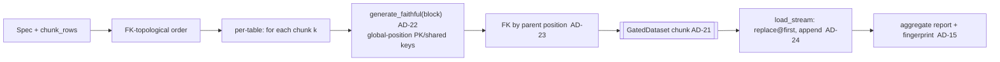

# TYMI PDE — Phase 2 architecture spine (out-of-core streaming)

Phase 1 validated the cross-team-consistency wedge on the in-memory engine. Phase 2 removes the
**memory ceiling**: provision a database from a few MB to hundreds of TB with peak memory bounded to
one row-chunk. It is a **streaming** extension, not a new engine — it reuses `generate_faithful` per
chunk and rides the exact seam Phase 1 built for it: **per-table substreams** (AD-20) and
**position-derived keys** (AD-16).

## Inherited invariants (binding, read-only)

AD-1 hexagonal · AD-2 bidirectional EngineAdapter · AD-4/AD-11 injected RNG / determinism ·
AD-6/AD-7 zero real values + LeakageGate · AD-9 permissive deps only · AD-10 canonical Schema ·
AD-13 whole-DB `generate_related` · AD-15 consistency unit + fingerprint · AD-16 position-derived
shared keys · AD-17 fixtures scan-and-reject · AD-18 non-prod guardrail · AD-19 provision
composition adapter · AD-20 per-table RNG substreams · AD-21 GatedDataset load boundary.

**No new dependencies** (AD-9): chunking is hand-rolled over the shipped numpy/pandas engine.

## New decisions

### AD-22 — Generation is chunked and position-addressable

- **Binds:** Phase-2 scale (arbitrarily large tables), NFR-4 determinism.
- **Prevents:** holding a whole table in RAM; a chunk boundary changing the data.
- **Rule:** a table is generated in fixed-size **logical row-blocks** of `chunk_rows`. Block `k`
  (covering global positions `[k·chunk_rows, …)`) draws from `table_substream(seed, table, k)` — the
  Phase-1 substream extended with a chunk index. A block reuses `generate_faithful(profile,
  rows=block_len, rng=block_substream)`; its **primary key and shared keys are assigned by GLOBAL
  position** (`surrogate PK = offset + arange`, `shared = reserved + offset + arange`), so keys are a
  pure function of position, independent of chunk boundaries. Peak memory is `O(chunk_rows)`.
  `chunk_rows` is pinned in the Spec and is part of the consistency unit (AD-15): identical
  `(Spec incl. chunk_rows + seed)` → **byte-identical** streamed output.

### AD-23 — Foreign keys resolve by parent position, never by materializing the parent

- **Binds:** out-of-core referential integrity.
- **Prevents:** a child needing its (possibly TB-sized) parent's keys in RAM to point at them.
- **Rule:** a child block resolves a foreign key by drawing parent **positions** in
  `[0, parent_total_rows)` from its block substream and mapping each to the parent key via the
  parent's deterministic key rule — `key(pos) = pos` for a surrogate PK, `reserved + pos` for a
  shared PK. The parent is never loaded. This requires the referenced parent key to be
  **position-addressable** (surrogate or shared, integer). A parent referenced by an FK whose key is
  a generated **natural** value is out of Phase-2 scope: it falls back to the in-memory path (bounded
  parent) or is rejected fail-closed. Self-referential FKs resolve the same way against the table's
  own total. Composite/multi-column FK targets are deferred (Phase-1 already left them as-generated).

### AD-24 — Streaming load: create-once, append-chunks, idempotent by truncate-first

- **Binds:** out-of-core write, NFR-F idempotency, AD-21 load boundary.
- **Prevents:** buffering a whole table before the write; a partial re-run leaving duplicates.
- **Rule:** the destination table is **created (clean-replaced) from the Schema on the first chunk**,
  then every later chunk is **appended**. Each chunk is sealed as a `GatedDataset` (AD-21 preserved
  per chunk) before it is written, so un-gated data still cannot reach a destination. Peak write
  memory is one chunk; a re-run replaces on the first chunk (truncate-first) and re-appends, so it
  stays idempotent (a failed run self-heals on re-run). Whole-DB cross-table transactionality remains
  out of scope (per-table streaming), corrected by re-run — inherited from Phase 1.

## What Phase 2 does NOT change

- The in-memory `generate_from_spec` (Phase 1) stays for small DBs, the library, and tests; the
  streaming path is additive. `provision` routes through streaming so provisioning is memory-bounded
  at any scale; both share the guardrail, gate, and fingerprint.
- No new engine, no new dependency, no change to the leakage gate / shared-key / fixture semantics —
  they run **per chunk**.

## Deferred (Phase 3 — depth & controls)

Cross-table statistical correlation (PDE-6, single-hop), referentially-consistent subsetting
(PDE-16, re-attaching shared keys to surviving rows), incremental/delta refresh (PDE-17). Out-of-core
**and** cross-table correlation together (a child value correlated with a non-position-addressable
parent value) is a named hard limit — Phase 3 tackles correlation on the in-memory path first.

