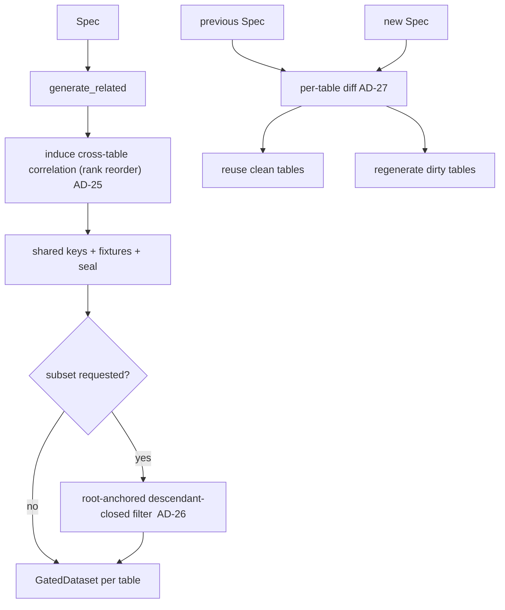

# TYMI PDE — Phase 3 architecture spine (depth & controls)

Phase 1 validated the wedge; Phase 2 removed the memory ceiling. Phase 3 adds the three
depth/control features the roadmap deferred: **cross-table statistical correlation** (PDE-6),
**referentially-consistent subsetting** (PDE-16), and **incremental / delta refresh** (PDE-17). All
three are **in-memory** (small-to-medium scale) additive capabilities; none weaken an inherited
invariant. No new dependencies (AD-9): everything is hand-rolled over numpy/pandas.

## Inherited invariants (binding, read-only)

AD-1 hexagonal · AD-4/AD-11 injected RNG / determinism · AD-6/AD-7 zero real values + LeakageGate ·
AD-9 permissive deps · AD-10 canonical Schema · AD-13 whole-DB generate · AD-15 consistency
unit + fingerprint · AD-16 position-derived shared keys · AD-21 GatedDataset boundary · AD-22..24
out-of-core streaming.

## New decisions

### AD-25 — Cross-table correlation is induced post-generation by rank reordering

- **Binds:** PDE-6 (single-hop cross-table correlation).
- **Prevents:** a child column being statistically independent of the parent row it references, when
  the source has a real dependency (e.g. order amount ↔ customer tier).
- **Rule:** a declared cross-correlation `(child.column ↔ parent.column, ρ)` is applied **after**
  `generate_related` has set the child's FK edges, by **rank-correlation induction** (a Gaussian
  copula reorder): the child column is *permuted* so its Spearman correlation with the referenced
  parent value is ≈ ρ, **preserving the child's marginal** (it is a reordering, never a rewrite).
  Single-hop (direct parent→child) only; multi-hop and cycles are deferred. ρ is declared in the
  Spec (a control); source-profiling of ρ over the join is a documented follow-up. Deterministic
  (injected rng, AD-4). Applied on the in-memory path; combining it with out-of-core streaming is a
  named limit (a child block would need its parent's referenced values, not position-addressable).

### AD-26 — Subsetting is root-anchored, descendant-closed, and shared-key-preserving

- **Binds:** PDE-16 (referentially-consistent subsetting).
- **Prevents:** a subset that drops a parent a surviving child still references (broken RI), or that
  renumbers shared keys so a subset no longer joins to a full sibling dataset.
- **Rule:** a subset is defined by a **root table + fraction** (or row count). The kept root rows are
  chosen deterministically (seeded); every table **reachable by following FKs from the root** is
  filtered to only the rows referenced by kept rows (descendant-closed downward, ancestor-closed
  upward — a kept child keeps its parents). **Shared keys are NOT renumbered** — a surviving row
  keeps its position-derived key (AD-16), so a subset still joins to a full dataset generated from
  the same Spec. The result is a smaller, referentially-consistent, still-gated DB.

### AD-27 — Delta refresh regenerates only the tables whose consistency inputs changed

- **Binds:** PDE-17 (incremental / delta refresh).
- **Prevents:** re-materialising an unchanged 100-table DB to update one table; and silently serving
  a stale table whose inputs did change.
- **Rule:** given a **previous** Spec and a **new** Spec, a per-table **diff** decides what to
  regenerate: a table is **dirty** iff its pinned Profile, row count, shared-key/fixture decls, or a
  global input it depends on (seed, chunk_rows, deps) changed; a table that is clean **and** whose
  FK ancestors are all clean is **reused** (not regenerated). Because keys are position-derived
  (AD-16), a regenerated table's keys still line up with the reused tables' FKs — the refresh stays
  referentially consistent without touching the reused tables. The refresh reports which tables were
  regenerated vs reused, and the consistency fingerprint of the new Spec is emitted.

## Deferred

Cross-table correlation **over streaming** (AD-25 is in-memory); **multi-hop** correlation and cyclic
FK correlation; source-profiled ρ (declared ρ for now); subsetting **over streaming**; a delta that
changes the FK topology itself (add/drop a table is a full regenerate of the affected subtree).

