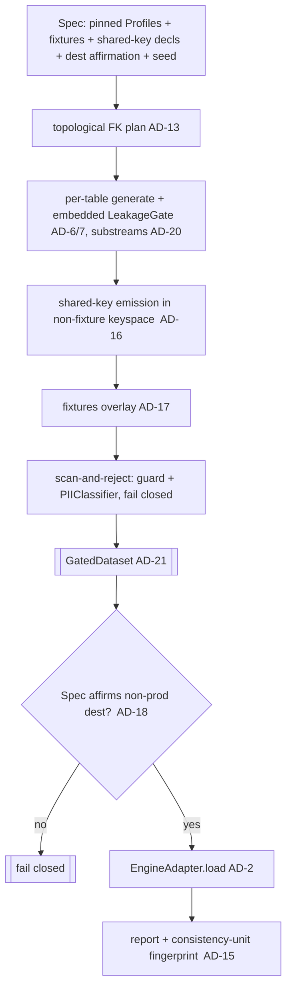
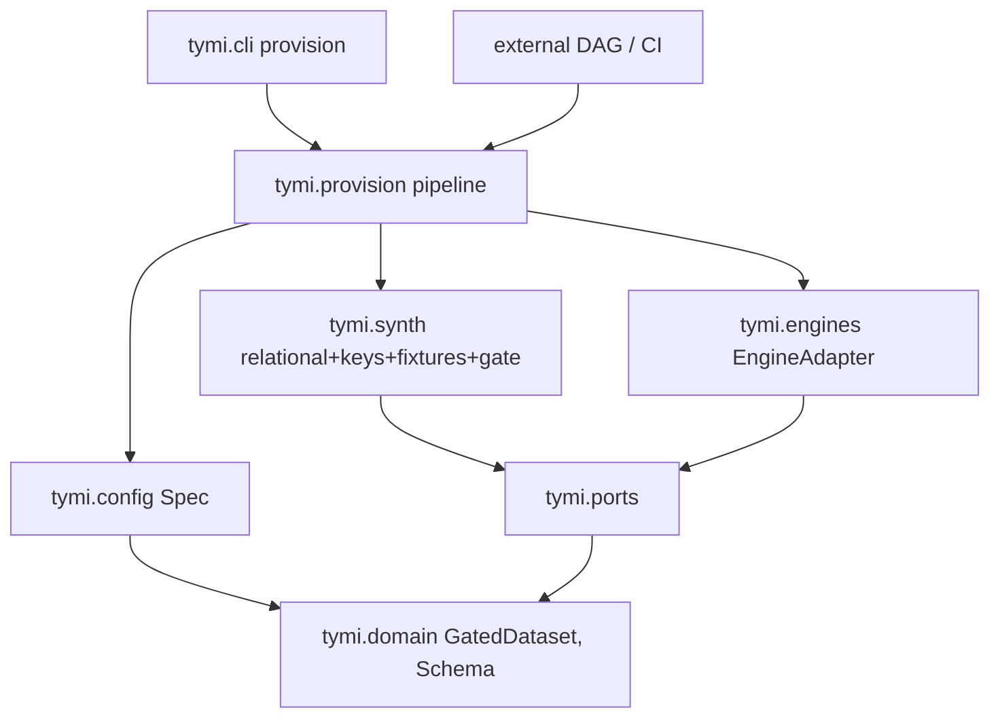

# Architecture Spine — TYMI PRD-1 Phase-1 (Obfuscated Prod-Like Dev Environments)

Epic-altitude spine. Inherits the MVP spine (`architecture-tymi-2026-07-01`) whole — its
paradigm, the 12 ADs, and its conventions are **binding, read-only**. This spine fixes only
the invariants Phase-1's stories open on top of that base. Out-of-core scale (Phase 2) and
cross-table correlation / subsetting / delta refresh (Phase 3) are **Deferred**.

## Design Paradigm

Unchanged from the parent: **hexagonal (ports & adapters) + pipes-and-filters**. Phase-1
capability lands inside the existing layers, no new paradigm. Note the composition boundary
(AD-1 / the repo's import-linter contract): **`tymi.core`/`ports`/`domain` never import
adapters**, so the whole-DB *provisioning pipeline* — which wires generation + engines — is a
**driving/composition adapter**, not core.

| Concern | Home |
| --- | --- |
| Provisioning pipeline (`provision`) — composition root | **`tymi.provision`** (new driving adapter, sibling to `cli`/`ui`) |
| Spec model (whole-DB, versioned) | `tymi.config` (extends the Pydantic `Config`) |
| Multi-table generation | `tymi.synth.relational` (**existing** `generate_related`, first-wired) |
| Per-table RNG substreams, shared-key emission, fixtures overlay | `tymi.synth` (new filters) |
| `GatedDataset` type + scan-and-reject gate mode | `tymi.domain` + `tymi.synth.leakage` |
| Introspection / load into destination | `tymi.engines` (**existing** `EngineAdapter`, AD-2) |
| `provision` CLI command | `tymi.cli` (thin call into `tymi.provision`) |

## Inherited Invariants

Binding from the parent MVP spine, by their original IDs — not re-derived, not renumbered.

| Inherited | From parent | Binds here |
| --- | --- | --- |
| AD-1 | MVP spine | `tymi.core`/`ports`/`domain` import no adapters; provisioning composes in a driving adapter |
| AD-2 | MVP spine | one bidirectional `EngineAdapter` per engine; source/destination are runtime roles |
| AD-3 | MVP spine | engines/mutators via entry points; core imports no concretes |
| AD-4 / AD-11 | MVP spine | one injected `numpy` `Generator` from `seed`; every stochastic port method takes `rng` |
| AD-5 | MVP spine | one Pydantic `Config` from YAML, semver `schema_version` — the Spec extends this |
| AD-6 / AD-7 | MVP spine | Profile holds no raw values; the **LeakageGate** runs (today embedded per-table in `generate_faithful`) |
| AD-8 | MVP spine | driving adapters build Config + invoke the pipeline; the pipeline is thin |
| AD-9 | MVP spine | permissive-license deps only; every new dep verified |
| AD-10 | MVP spine | Dataset = `DataFrame` + canonical `Schema`; stages preserve Schema |
| AD-12 | MVP spine | Evaluate discriminates by `run_mode`; provisioning uses the faithful branch |

## Invariants & Rules

### AD-13 — Whole-DB generation first-wires the existing topological generator `[ADOPTED]`

- **Binds:** PDE-1, PDE-4.
- **Prevents:** a second, divergent multi-table generator or table-ordering scheme.
- **Rule:** multi-table generation goes through the existing `synth.relational.generate_related`
  (topological FK order, per-table `generate_faithful`, unique PK, junction handling) — today
  it has no callers, so this is **first-wiring**, not extending a live path. Phase-1
  capabilities layer around it; there is never a parallel generation path.

### AD-14 — The Spec is a versioned whole-DB superset of Config

- **Binds:** PDE-2, PDE-3.
- **Prevents:** divergent spec formats; ambiguity over where fixtures, sensitive marks, and
  pinned Profiles live.
- **Rule:** a **Spec** is one artifact with `schema_version` bundling `{the pinned per-table
  Profile artifacts, sensitive-column marks, fixtures, shared-key declarations, destination
  affirmation, seed, tolerances}`. It extends the MVP `Config` (AD-5). `provision` consumes
  exactly one Spec; auto-bootstrap produces a first cut, humans edit it, it is reviewed as code.

### AD-15 — Identity is the consistency unit; the Spec pins the Profile *artifacts*

- **Binds:** PDE-11, G4.
- **Prevents:** "same spec, drifted/re-profiled source → mismatched entities → joins that look
  valid but are garbage"; a fingerprint that lies.
- **Rule:** reproducible identity is **(Spec + the pinned Profile artifacts it bundles + seed +
  pinned dependency versions + the fixture set)**. Regeneration reuses the **bundled Profile
  artifacts** (each with its own fixed salt) **offline** — it never re-profiles the source
  (profiling salt is a random per-run nonce, so re-profiling would drift). The provisioning
  report emits a **consistency-unit fingerprint** = a hash over those exact artifacts.

### AD-16 — Shared entity keys are position-derived, source- and seed-independent `[resolves OQ-5]`

- **Binds:** PDE-12, PDE-10.
- **Prevents:** cross-team key divergence; fixture/generated-key collision.
- **Rule:** columns declared `shared` in the Spec are emitted by a deterministic keyer
  `key(table, row_position)` that depends **only on the table name and row position** — **not
  on the source and not on the seed** — so two teams get identical shared keys given the Spec's
  **pinned per-table row counts**. (This supersedes PDE-12's earlier "seed-derived" wording,
  corrected in the PRD.) Fixtures occupy an **explicitly declared, disjoint reserved keyspace
  block** in the Spec; the generator emits shared keys only outside that block and **validates
  disjointness, failing closed on any overlap**. Under Phase-3 filtering/subsetting, keys must
  re-attach to surviving rows — deferred.

### AD-17 — Fixtures: inject-verbatim, regenerate-never, scanned into the GatedDataset

- **Binds:** PDE-8, PDE-9, PDE-10.
- **Prevents:** fixtures becoming a PII bypass around the leakage gate.
- **Rule:** fixtures are a **post-generation overlay** in the reserved fixture keyspace (AD-16).
  They **skip obfuscation/regeneration**, but the overlaid frame then passes a **scan-and-reject
  gate mode** — verify every fixture cell against the LeakageGate's guard **and** the
  `PIIClassifier` port, **fail closed** on a real value/PII hit, **no regeneration**. Only the
  scanned result becomes a `GatedDataset` (AD-21). Adding a fixture requires a **logged
  attestation**; synthetic fixtures are preferred.

### AD-18 — Provision fails closed unless the Spec affirms a non-prod destination

- **Binds:** PDE-14, inherited NFR-E / CM2.
- **Prevents:** writing to production; a soft "obfuscate?" checkbox; two owners of the guardrail.
- **Rule:** the **single owner** is the Spec's `destination` block, which must carry an explicit
  **`environment: nonprod` affirmation** AND not match the configured **prod deny-list**
  (a list of host/database glob patterns). **Fail-closed default:** a missing affirmation
  aborts before any write — an empty deny-list never means "allow all". There is no code path
  that loads a non-`GatedDataset` (AD-21) into a destination.

### AD-19 — `provision` is a thin composition-adapter pipeline; orchestration stays external

- **Binds:** PDE-13.
- **Prevents:** scheduling/DAG logic in the core; the CLI and a DAG re-implementing the flow;
  the import-contract violation of composing in `tymi.core`.
- **Rule:** `tymi.provision` (a driving adapter) exposes one pipeline that the CLI command and
  any external DAG/CI job call **identically**:
  `load Spec → per-table generate (LeakageGate embedded per-table, AD-6/7) → per-table RNG
  substreams (AD-20) → shared-key emission (AD-16) → fixtures overlay + scan-and-reject
  (AD-17) → GatedDataset (AD-21) → destination guardrail (AD-18) → EngineAdapter.load →
  provisioning report (AD-15 fingerprint)`. Retries and scheduling live in the external
  scheduler.

### AD-20 — Per-table RNG substreams make relationships cross-team-stable

- **Binds:** PDE-11, PDE-12, G4.
- **Prevents:** an unrelated table's row count (or generation order) shifting a single shared
  RNG's state, so the *same* shared entities get *different* FK relationships across teams —
  joins that execute and return garbage (the AD-15 failure, re-entering through generation).
- **Rule:** each table is generated from a **deterministic per-table substream**
  `SeedSequence(seed, table_name).generate_state(...)` (a fresh `Generator` per table), so a
  table's output — including its `generate_related` FK-edge sampling — is **independent of any
  other table's row count or order**. `generate_related`'s current single-shared-`rng`
  threading is replaced by per-table substreams (a real change to the shipped code, not reuse).

### AD-21 — The load boundary accepts only a GatedDataset

- **Binds:** PDE-7, PDE-9, PDE-14, G2, CM1.
- **Prevents:** any post-generation mutation (shared keys, fixtures) or a raw dataset reaching
  the destination **un-gated** — the fixtures-as-PII-bypass hole, as a *type* error not a
  discipline.
- **Rule:** a **`GatedDataset`** (in `tymi.domain`) can be constructed **only** by passing a
  `Dataset` through the LeakageGate + fixture scan-and-reject (AD-17). The provisioning
  `load` step (and any destination write) accepts **only** a `GatedDataset`; a raw `Dataset` is
  a type error. All post-generation overlays happen **before** the `GatedDataset` is minted.

### Provisioning flow (Phase 1)

### Dependency direction

## Consistency Conventions

| Concern | Convention |
| --- | --- |
| Spec artifact | one versioned YAML (`schema_version`), superset of `Config`; bundles the pinned Profile artifacts; reviewed as code |
| Shared keys | declared per-table; `key(table,row_position)`, source- and seed-independent; disjoint from the reserved fixture block; disjointness validated, fail-closed |
| Determinism | per-table RNG substreams from `(seed, table)` (AD-20); pinned deps; identity = consistency unit (AD-15) |
| Fixtures | declared in the Spec; overlaid post-gen; scanned into the `GatedDataset`; attested |
| Load boundary | only a `GatedDataset` reaches a destination (AD-21) |
| Destination safety | Spec-owned non-prod affirmation + prod deny-list; fail-closed default; obfuscation never optional (AD-18) |
| Credential isolation | source access read-only; secrets on the runner, never in the Spec (inherited NFR-6/NFR-D) |
| Idempotency | re-running `provision` is safe — clean-replace or transactional load, no partial state (NFR-F) |
| Errors | typed `TymiError` subclasses; guardrail/gate breaches raise before any write |

## Stack

Inherited from the parent; **no new runtime dependency** for Phase 1 (Spec + fixtures are YAML
via the shipped Pydantic/PyYAML stack; generation/introspection/load reuse shipped code;
substreams use `numpy.random.SeedSequence`, already present). Any Phase-2/3 dependency must
re-verify AD-9.

## Structural Seed

New code (owned by the code once built; listed to prevent placement drift):

- `tymi/config/spec.py` — the whole-DB `Spec` model (AD-14) + auto-bootstrap; bundles Profiles.
- `tymi/provision/pipeline.py` — the thin provisioning pipeline (AD-19), a **driving adapter**.
- `tymi/synth/substreams.py` — per-table RNG substream derivation (AD-20).
- `tymi/synth/keys.py` — shared source-independent key emission + keyspace validation (AD-16).
- `tymi/synth/fixtures.py` — fixtures overlay + attestation (AD-17).
- `tymi/synth/leakage.py` — a **scan-and-reject** gate mode (AD-17) alongside the existing gate.
- `tymi/domain/artifacts.py` — the `GatedDataset` type (AD-21).
- `tymi/provision/guardrail.py` — destination non-prod affirmation + deny-list (AD-18).
- `tymi/cli/app.py` — the `provision` command (thin call into `tymi.provision`).

## Deferred

- **Phase 2 (scale, an engine rewrite):** out-of-core/chunked table-parallel generation
  (NFR-A/B); the LeakageGate reference-set → Bloom/disk-backed membership; BLAS-threading pin
  for determinism at scale. Supersedes AD-10's single-DataFrame-per-run assumption. Note: the
  per-table substreams (AD-20) are the seam the chunked/parallel design extends.
- **Phase 3 (depth & controls):** cross-table statistical correlation (PDE-6, single-hop
  first), referentially-consistent subsetting (PDE-16, incl. re-attaching shared keys to
  surviving rows), incremental/delta refresh (PDE-17).
- **Upstream correction:** PRD PDE-12 reworded from "seed-derived" to "position-derived,
  source-and-seed-independent" to match AD-16 (applied to the PRD).
